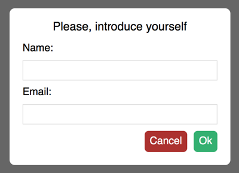

# PurePopup

<p style="text-align:center"></p>

## Pure Vanilla JavaScript library with no dependences

---

## Simple popup allows to use:
 - alert,
 - confirm,
 - prompt.

---

### Support IE9+

---

## Include

``` html
<!DOCTYPE html>
<html lang="en">
<head>
    ...
    <link rel="stylesheet" href="path/purePopup.min.css">
</head>
<body>
    ...
    <script src="path/purePopup.min.js"></script>
</body>
</html> 
```

---

## Params

PurePopup.type(params, callback);
 - type: (alert|confirm|prompt)
 - params: object
 - callback: function
 
Parameter | Use in | Type | Default | Description
--------- | ------ | ---- | ------- | -----------
title     | alert, confirm, prompt | string | document.title | Popop title
buttons   | alert, confirm, prompt | object | ``` {ok: 'Ok'} ``` for alert <br> and <br> ``` {ok: 'Ok', cancel: 'Cancel'} ``` for confirm and prompt | Buttons that close popup and call callback function with object containing confirm parameter as result. confirm - string, containing the key of clicked button from buttons object. For customize buttons use '```._buttonkey_```' class
inputs    | prompt | object | ``` {name: 'Please, enter your name'} ``` | For prompt it generates labels and inputs. Key of object - key in callback parameter with value of input value. 
callback(result) | alert, confirm, prompt | function | null | Callback function calls when popup has closed. Result contains object with prompt parameter - clicked button value (noActionCancel if close popup by click on background space) and inputs values (key: value).

---

## Full example

``` javascript
document.getElementById('button').addEventListener('click', function(){
            
    PurePopup.prompt({
        title: 'Please, introduce yourself',
        buttons: {
            okButton: 'Continue',
            cancelButton: 'Cancel'
        },
        inputs: {
            nameInput: 'Name:',
            emailInput: 'Email:'
        }
    }, function(result) {
        
        if (result.confirm == 'okButton') {

            PurePopup.alert({
                title: 'Nice to meet you, ' + result.nameInput + ' ' + result.emailInput
            });

        } else if (result.confirm == 'cancelButton') {
            
            PurePopup.confirm({
                title: 'Do you really want to quit?',
                buttons: {
                    yes: 'Yes, I do',
                    no: 'No'
                },
            }, function(result) {

                if (result.confirm == 'yes') {

                    PurePopup.alert({title: 'So, goodbye'});

                } else if (result.confirm == 'no') {

                    PurePopup.alert({title: 'Thank you'});
                    
                }
                
            });
            
        } else if (result.confirm == 'noActionCancel') {
            // nothing to do
        }
        
    });
});
```